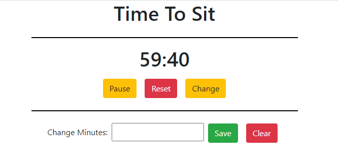

# Autonomous Timer
- An application that reminds users with standing desks to interval between standing up, sitting down, and taking breaks to live a healthy working lifestyle

> - Maintained by: `James Dinh - jdinh8124`

## Live Demo
Link: [Live Site](https://autonomous-timer-app.jamestdinh.com/)

## Technologies Used
- React.js
- Webpack 
- Bootstrap 4
- HTML5
- CSS3
- AWS EC2
- Babel

## Features
- User can user the timer to create intervals between standing and sitting
- User can schedule breaks in between standing and sitting
- User can chane alarm sounds
- User can adjust time at each interval

## Future Additions
- User saved information
- Updated UI
- More sounds
- Option to add customize intervals

## Preview

